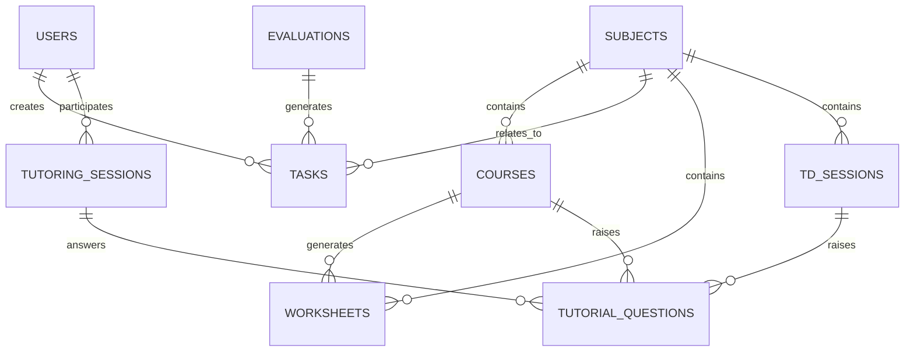

# Expression fonctionnelle — Application Web Flask de suivi d’accompagnement L1 Droit

**Projet :** Application Web d’accompagnement méthodologique pour une étudiante entrant en L1 Droit  
**Technologie cible :** Flask / Python  
**Version :** 1.0  
**Date :** 30/06/2026  
**Statut :** Fiche fonctionnelle de cadrage pour MVP puis évolutions

---

## 1. Contexte du projet

L’application vise à accompagner une étudiante entrant en première année de licence de droit, dans un contexte où plusieurs dispositifs d’aide peuvent être combinés :

- stage de pré-rentrée ;
- accompagnement méthodologique externe, par exemple Juridicas ou Mission Droit ;
- tutorat hebdomadaire avec un étudiant de Master 2 ;
- accompagnement parental limité à l’organisation, à la méthode et au suivi de la régularité.

L’objectif n’est pas de remplacer le travail universitaire, ni de corriger le contenu juridique à la place d’un enseignant ou d’un tuteur. L’application doit plutôt servir de **tableau de bord de suivi**, de **planificateur de travail**, de **carnet de progression** et de **support de coordination** entre l’étudiante, le parent accompagnateur et le tuteur.

---

## 2. Objectifs généraux

L’application doit permettre de :

1. structurer le travail hebdomadaire ;
2. éviter l’accumulation du retard ;
3. suivre les cours à relire ;
4. suivre les fiches à produire ;
5. préparer les TD ;
6. préparer les séances de tutorat ;
7. suivre les évaluations, devoirs, galops d’essai et partiels ;
8. identifier les matières fragiles ;
9. organiser les révisions ;
10. maintenir une relation d’accompagnement non conflictuelle.

---

## 3. Principes directeurs

| Principe | Description |
|---|---|
| Simplicité | L’interface doit rester légère et compréhensible. |
| Régularité | L’application doit favoriser un suivi hebdomadaire, non un contrôle quotidien excessif. |
| Autonomie | L’étudiante doit rester actrice de son travail. |
| Non-surveillance | L’outil ne doit pas être vécu comme un outil de contrôle parental. |
| Orientation action | Chaque suivi doit déboucher sur une action claire. |
| Priorisation | L’application doit aider à distinguer l’urgent, l’important et le secondaire. |
| Confidentialité | Les données personnelles et pédagogiques doivent rester limitées et protégées. |

---

## 4. Périmètre fonctionnel

### 4.1 Périmètre inclus dans le MVP

Le MVP couvre les fonctionnalités suivantes :

- authentification simple ;
- gestion des matières ;
- gestion des cours ;
- gestion des tâches ;
- gestion des TD ;
- gestion des fiches de révision ;
- gestion des questions pour le tuteur ;
- tableau de bord hebdomadaire ;
- suivi des échéances ;
- alertes simples ;
- synthèse hebdomadaire.

### 4.2 Périmètre hors MVP

Les fonctionnalités suivantes sont à prévoir en V2 ou V3 :

- import automatique de l’emploi du temps universitaire ;
- synchronisation Google Calendar / Outlook ;
- notifications par email ;
- notifications Discord ;
- gestion documentaire avancée ;
- correction assistée par IA ;
- module de statistiques avancées ;
- application mobile native ;
- espace complet pour l’organisme externe ;
- messagerie intégrée.

---

## 5. Acteurs et rôles

### 5.1 Étudiante

L’étudiante est l’utilisatrice principale. Elle peut :

- consulter son tableau de bord ;
- créer et modifier ses cours ;
- créer et modifier ses tâches ;
- créer et modifier ses fiches ;
- ajouter ses questions pour le tuteur ;
- préparer ses TD ;
- renseigner ses notes ;
- renseigner son ressenti hebdomadaire ;
- clôturer ses tâches.

### 5.2 Parent accompagnateur

Le parent n’intervient pas comme professeur de droit, mais comme accompagnateur méthodologique. Il peut :

- consulter le tableau de bord ;
- visualiser les retards ;
- aider à prioriser la semaine ;
- suivre les échéances ;
- consulter les questions préparées pour le tuteur ;
- ajouter des remarques d’organisation ;
- consulter les bilans hebdomadaires.

Il ne doit pas nécessairement pouvoir modifier tous les contenus produits par l’étudiante.

### 5.3 Tuteur

Le tuteur est un étudiant avancé en droit, par exemple Master 2. Il peut :

- consulter les questions préparées ;
- consulter certains TD ou fiches partagés ;
- ajouter une réponse ou un commentaire ;
- saisir un compte rendu de séance ;
- proposer des exercices ;
- signaler les notions à retravailler.

### 5.4 Administrateur

L’administrateur gère l’application. Il peut :

- créer les comptes ;
- gérer les rôles ;
- gérer les paramètres ;
- sauvegarder les données ;
- corriger les anomalies techniques.

---

## 6. Matrice des droits

| Fonctionnalité | Étudiante | Parent | Tuteur | Admin |
|---|---:|---:|---:|---:|
| Consulter tableau de bord | Oui | Oui | Partiel | Oui |
| Créer une matière | Oui | Oui | Non | Oui |
| Créer un cours | Oui | Oui | Non | Oui |
| Modifier un cours | Oui | Limité | Non | Oui |
| Créer une tâche | Oui | Oui | Non | Oui |
| Clôturer une tâche | Oui | Non conseillé | Non | Oui |
| Créer une fiche | Oui | Non | Non | Oui |
| Commenter une fiche | Oui | Oui | Oui | Oui |
| Créer une question tuteur | Oui | Oui | Oui | Oui |
| Répondre à une question tuteur | Non | Non | Oui | Oui |
| Créer un compte rendu de tutorat | Oui | Consultation | Oui | Oui |
| Voir notes et évaluations | Oui | Oui | Oui si partagé | Oui |
| Gérer utilisateurs | Non | Non | Non | Oui |

---

## 7. Parcours utilisateur principal

### 7.1 Parcours hebdomadaire de l’étudiante

1. L’étudiante consulte son tableau de bord.
2. Elle voit les cours à relire, les TD à préparer et les fiches à finaliser.
3. Elle ajoute ou valide les tâches de la semaine.
4. Elle prépare ses questions pour le tuteur.
5. Elle réalise les tâches.
6. Elle clôture les tâches terminées.
7. Après la séance de tutorat, elle saisit les corrections et actions à faire.
8. En fin de semaine, elle remplit un bilan rapide.
9. La semaine suivante est planifiée à partir des retards et priorités.

### 7.2 Parcours parental

1. Le parent consulte la synthèse hebdomadaire.
2. Il identifie les points de blocage.
3. Il aide à prioriser les tâches.
4. Il ne corrige pas le droit.
5. Il prépare avec l’étudiante les questions à poser au tuteur.
6. Il vérifie que les échéances importantes sont anticipées.

### 7.3 Parcours tuteur

1. Le tuteur consulte les questions avant la séance.
2. Il traite les points de méthode ou de contenu.
3. Il laisse un compte rendu.
4. Il propose des exercices ou actions de progression.
5. Il marque les questions comme traitées.

---

# 8. Modules fonctionnels

---

## Module 1 — Tableau de bord hebdomadaire

### Objectif

Le tableau de bord doit donner une vue immédiate de la semaine.

Il doit répondre aux questions suivantes :

- Que faut-il faire cette semaine ?
- Quels sont les retards ?
- Quels TD sont à préparer ?
- Quelles fiches sont à produire ou à réviser ?
- Quelles questions faut-il poser au tuteur ?
- Quels sont les prochains jalons ?

### Informations affichées

| Élément | Description |
|---|---|
| Tâches urgentes | Tâches à faire dans les 48 heures |
| TD à préparer | TD dont la date approche |
| Cours non relus | Cours non relus dans les 48h |
| Fiches en retard | Fiches non créées ou non validées |
| Questions tuteur | Questions ouvertes |
| Prochaines évaluations | Partiels, galops, devoirs |
| Retard par matière | Indicateur de charge |
| Bilan hebdomadaire | Synthèse de progression |

### Indicateurs principaux

| Indicateur | Calcul |
|---|---|
| Cours relus sous 48h | cours relus / cours ajoutés |
| TD préparés à temps | TD prêts / TD planifiés |
| Fiches validées | fiches validées / fiches prévues |
| Questions tuteur ouvertes | nombre de questions non traitées |
| Tâches en retard | tâches non terminées après échéance |
| Charge hebdomadaire | total estimé des tâches à faire |

### Critères d’acceptation

- L’utilisateur doit voir en moins de 10 secondes les priorités de la semaine.
- Les retards doivent être visibles.
- Les éléments urgents doivent apparaître en haut.
- Le tableau de bord ne doit pas dépasser une page principale trop dense.

---

## Module 2 — Gestion des matières

### Objectif

Permettre de créer et suivre les matières de L1 Droit.

### Exemples de matières

- Introduction au droit ;
- Droit civil ;
- Droit constitutionnel ;
- Institutions juridictionnelles ;
- Histoire du droit ;
- Méthodologie juridique ;
- Anglais juridique ;
- Relations internationales ;
- Économie ;
- Option universitaire.

### Données d’une matière

| Champ | Type | Obligatoire | Exemple |
|---|---|---:|---|
| Nom | Texte | Oui | Droit civil |
| Semestre | Liste | Oui | S1 |
| Type | Liste | Non | CM / TD / CM+TD |
| Coefficient | Numérique | Non | 4 |
| Enseignant | Texte | Non | Mme Dupont |
| Chargé de TD | Texte | Non | M. Martin |
| Niveau ressenti | Liste | Non | Facile / Moyen / Difficile |
| Couleur | Texte | Non | Bleu |
| Active | Booléen | Oui | Oui |

### Fonctions attendues

- créer une matière ;
- modifier une matière ;
- archiver une matière ;
- afficher les tâches liées à une matière ;
- afficher les fiches liées à une matière ;
- afficher les notes liées à une matière ;
- afficher les retards par matière.

---

## Module 3 — Suivi des cours

### Objectif

Permettre de suivre chaque séance de cours et d’éviter que les cours ne soient jamais relus.

### Règle pédagogique

Un cours doit idéalement être :

1. relu dans les 48h ;
2. transformé en fiche ;
3. associé à des questions si la notion n’est pas comprise.

### Données d’un cours

| Champ | Type | Obligatoire | Exemple |
|---|---|---:|---|
| Matière | Relation | Oui | Droit civil |
| Date du cours | Date | Oui | 2026-09-14 |
| Titre | Texte | Oui | La responsabilité civile |
| Type | Liste | Oui | CM / TD |
| Support disponible | Booléen | Non | Oui |
| Relu | Booléen | Oui | Non |
| Date de relecture | Date | Non | 2026-09-15 |
| Fiche créée | Booléen | Oui | Non |
| Niveau de compréhension | 1 à 5 | Non | 3 |
| Questions associées | Relation | Non | 2 questions |

### Statuts possibles

| Statut | Description |
|---|---|
| À relire | Cours ajouté mais non relu |
| Relu | Cours relu au moins une fois |
| Fiche à faire | Le cours doit être synthétisé |
| Fiche faite | Une fiche existe |
| À revoir | Le niveau de compréhension est faible |

### Alertes

- Cours non relu après 48h.
- Cours sans fiche après 7 jours.
- Cours avec niveau de compréhension inférieur ou égal à 2.
- Cours sans question alors que le niveau de compréhension est faible.

---

## Module 4 — Gestion des tâches

### Objectif

Centraliser toutes les actions à réaliser.

### Types de tâches

| Type | Exemple |
|---|---|
| Relecture | Relire le cours sur la hiérarchie des normes |
| Fiche | Produire la fiche du chapitre |
| TD | Préparer le TD n°2 |
| Révision | Revoir les fiches du droit civil |
| Méthode | Travailler la dissertation juridique |
| Tutorat | Préparer les questions |
| Administratif | Finaliser l’inscription |
| Exercice | Faire un cas pratique |

### Données d’une tâche

| Champ | Type | Obligatoire | Exemple |
|---|---|---:|---|
| Titre | Texte | Oui | Préparer TD droit civil |
| Description | Texte long | Non | Lire les documents 1 à 4 |
| Matière | Relation | Non | Droit civil |
| Type | Liste | Oui | TD |
| Priorité | Liste | Oui | Haute |
| Date limite | Date | Non | 2026-09-20 |
| Durée estimée | Durée | Non | 90 min |
| Durée réalisée | Durée | Non | 75 min |
| Statut | Liste | Oui | À faire |
| Créateur | Utilisateur | Oui | Étudiante |
| Assigné à | Utilisateur | Oui | Étudiante |

### Statuts

| Statut | Description |
|---|---|
| À faire | Tâche créée |
| En cours | Travail commencé |
| Bloquée | Tâche impossible à terminer sans aide |
| Terminée | Tâche réalisée |
| Reportée | Tâche déplacée |
| Annulée | Tâche abandonnée |

### Critères d’acceptation

- Une tâche doit pouvoir être créée en moins de 30 secondes.
- Une tâche peut être associée à une matière.
- Une tâche en retard doit être visible.
- Une tâche bloquée doit pouvoir générer une question pour le tuteur.

---

## Module 5 — Préparation des TD

### Objectif

Suivre la préparation des TD, qui sont essentiels en licence de droit.

### Données d’un TD

| Champ | Type | Obligatoire | Exemple |
|---|---|---:|---|
| Matière | Relation | Oui | Droit constitutionnel |
| Date du TD | Date | Oui | 2026-09-22 |
| Thème | Texte | Oui | La séparation des pouvoirs |
| Documents à lire | Texte long | Non | Documents 1 à 5 |
| Exercice demandé | Texte long | Non | Dissertation |
| Méthode | Liste | Non | Dissertation / cas pratique / commentaire |
| Statut | Liste | Oui | Non commencé |
| Questions | Relation | Non | 3 questions |
| Correction reprise | Booléen | Non | Non |

### Statuts de préparation

| Statut | Description |
|---|---|
| Non commencé | Aucun travail fait |
| Documents lus | Les documents ont été lus |
| Brouillon fait | Le travail est commencé |
| Prêt | Le TD est préparé |
| Corrigé repris | La correction a été retravaillée |

### Checklist selon la méthode

#### Cas pratique

- les faits utiles sont identifiés ;
- le problème juridique est formulé ;
- la règle de droit est posée ;
- la règle est appliquée aux faits ;
- la conclusion est claire.

#### Dissertation juridique

- les termes du sujet sont définis ;
- le sujet est délimité ;
- une problématique est formulée ;
- le plan est apparent ;
- les transitions sont prévues.

#### Commentaire d’arrêt

- les faits sont identifiés ;
- la procédure est comprise ;
- les prétentions sont repérées ;
- le problème de droit est formulé ;
- la solution est expliquée ;
- la portée est analysée.

### Alertes

- TD dans moins de 3 jours non commencé.
- TD dans moins de 24h non prêt.
- TD terminé mais correction non reprise après 7 jours.

---

## Module 6 — Fiches de révision

### Objectif

Permettre la création, le suivi et la révision des fiches.

### Format type d’une fiche

Chaque fiche doit contenir :

- titre ;
- matière ;
- chapitre ;
- définition principale ;
- idées essentielles ;
- règles importantes ;
- articles / décisions à connaître ;
- exemple concret ;
- pièges à éviter ;
- question possible à l’examen ;
- niveau de maîtrise.

### Données d’une fiche

| Champ | Type | Obligatoire | Exemple |
|---|---|---:|---|
| Titre | Texte | Oui | La responsabilité civile |
| Matière | Relation | Oui | Droit civil |
| Chapitre | Texte | Non | Chapitre 2 |
| Contenu | Markdown | Oui | Texte structuré |
| Statut | Liste | Oui | Brouillon |
| Niveau de maîtrise | 1 à 5 | Non | 3 |
| Date de création | Date | Oui | Automatique |
| Dernière révision | Date | Non | 2026-09-25 |
| Prochaine révision | Date | Non | 2026-10-02 |

### Statuts

| Statut | Description |
|---|---|
| À faire | Fiche identifiée mais non créée |
| Brouillon | Fiche commencée |
| À relire | Fiche à vérifier |
| Validée | Fiche exploitable |
| À revoir | Fiche fragile |
| Archivée | Fiche ancienne |

### Checklist qualité

| Critère | Oui / Non |
|---|---|
| La définition est claire |
| La règle principale est identifiée |
| Les notions proches sont distinguées |
| Il y a au moins un exemple |
| Les pièges sont indiqués |
| La fiche tient en 1 à 2 pages |
| Une question d’examen est proposée |

### Répétition espacée

| Moment | Action |
|---|---|
| J+1 | première relecture |
| J+7 | consolidation |
| J+15 | vérification |
| J+30 | réactivation |
| Avant partiel | révision finale |

---

## Module 7 — Questions pour le tuteur

### Objectif

Maximiser l’efficacité des séances de tutorat.

### Types de questions

| Type | Exemple |
|---|---|
| Compréhension | Quelle différence entre responsabilité contractuelle et délictuelle ? |
| Méthode | Comment structurer une dissertation ? |
| Correction | Peux-tu relire mon introduction ? |
| Révision | Quelles notions prioriser ? |
| Partiel | Quel type de sujet peut tomber ? |
| Organisation | Comment travailler cette matière ? |

### Données d’une question

| Champ | Type | Obligatoire | Exemple |
|---|---|---:|---|
| Question | Texte long | Oui | Je ne comprends pas la distinction X/Y |
| Matière | Relation | Non | Droit civil |
| Type | Liste | Oui | Compréhension |
| Priorité | Liste | Oui | Haute |
| Statut | Liste | Oui | À poser |
| Réponse du tuteur | Texte long | Non | Explication donnée |
| Action associée | Texte | Non | Refaire l’exercice |
| Date de création | Date | Oui | Automatique |
| Date de traitement | Date | Non | 2026-09-19 |

### Statuts

| Statut | Description |
|---|---|
| À poser | Question préparée |
| Posée | Question traitée en séance |
| Réponse à revoir | Réponse à retravailler |
| Transformée en tâche | Une action a été créée |
| Clôturée | Question terminée |

### Critères d’acceptation

- Une question doit pouvoir être créée depuis un cours, une fiche, un TD ou une tâche.
- Une question prioritaire doit apparaître dans le tableau de bord.
- Une question traitée doit pouvoir générer une action.

---

## Module 8 — Séances de tutorat

### Objectif

Tracer les séances de tutorat et les actions décidées.

### Données d’une séance

| Champ | Type | Obligatoire | Exemple |
|---|---|---:|---|
| Date | Date | Oui | 2026-09-18 |
| Durée | Durée | Oui | 2h |
| Tuteur | Utilisateur | Oui | Étudiant M2 |
| Sujets traités | Texte long | Oui | Droit civil, méthode |
| Questions traitées | Relation | Non | 5 questions |
| Points compris | Texte long | Non | Méthode du cas pratique |
| Points fragiles | Texte long | Non | Qualification juridique |
| Actions à faire | Relation | Non | 3 tâches |
| Commentaire tuteur | Texte long | Non | À retravailler |

### Sortie attendue après séance

Chaque séance doit idéalement produire :

1. les points clarifiés ;
2. les points encore fragiles ;
3. les exercices à refaire ;
4. les tâches à réaliser avant la prochaine séance ;
5. les priorités de la semaine.

---

## Module 9 — Évaluations, devoirs et notes

### Objectif

Suivre les évaluations et transformer les résultats en plan de progression.

### Types d’évaluations

- devoir maison ;
- TD noté ;
- interrogation ;
- galop d’essai ;
- partiel ;
- oral ;
- examen blanc.

### Données d’une évaluation

| Champ | Type | Obligatoire | Exemple |
|---|---|---:|---|
| Matière | Relation | Oui | Droit civil |
| Type | Liste | Oui | Galop d’essai |
| Date | Date | Oui | 2026-11-05 |
| Coefficient | Numérique | Non | 2 |
| Méthode | Liste | Non | Cas pratique |
| Sujet | Texte long | Non | Sujet donné |
| Note | Numérique | Non | 9 |
| Commentaire | Texte long | Non | Manque d’application |
| Action corrective | Relation | Non | Refaire 2 cas |
| Statut | Liste | Oui | À préparer |

### Statuts

| Statut | Description |
|---|---|
| À préparer | Évaluation connue |
| En révision | Préparation commencée |
| Passée | Évaluation faite |
| Corrigée | Note et correction reçues |
| Exploitée | Actions correctives définies |

### Analyse post-évaluation

| Problème | Action possible |
|---|---|
| Méthode faible | Refaire une fiche méthode |
| Cours non maîtrisé | Réviser la fiche concernée |
| Mauvaise application | Refaire un cas pratique |
| Plan fragile | Travailler la problématique |
| Manque de précision | Reprendre les définitions |

---

## Module 10 — Planning et échéances

### Objectif

Organiser les tâches dans le temps.

### Vues nécessaires

- vue semaine ;
- vue mois ;
- liste des échéances ;
- liste des tâches en retard ;
- vue par matière.

### Données d’un créneau de travail

| Champ | Type | Obligatoire | Exemple |
|---|---|---:|---|
| Date | Date | Oui | 2026-09-15 |
| Heure début | Heure | Non | 18:00 |
| Heure fin | Heure | Non | 19:30 |
| Matière | Relation | Non | Droit civil |
| Type de travail | Liste | Oui | Relecture |
| Tâche associée | Relation | Non | Tâche #42 |
| Statut | Liste | Oui | Prévu |

### Règles

- L’application ne doit pas imposer un suivi minute par minute.
- L’application doit privilégier les livrables terminés.
- Le planning doit permettre de déplacer facilement une tâche.
- Les tâches urgentes doivent remonter automatiquement.

---

## Module 11 — Bilan hebdomadaire

### Objectif

Faire un point court chaque semaine.

### Questions du bilan

Chaque semaine, l’étudiante peut renseigner :

1. Qu’est-ce qui a été fait ?
2. Qu’est-ce qui n’a pas été fait ?
3. Qu’est-ce qui bloque ?
4. Quelles matières semblent difficiles ?
5. Quelles questions faut-il poser au tuteur ?
6. Quel est le niveau de charge ?
7. Quel est le niveau de confiance ?
8. Quelles sont les priorités de la semaine suivante ?

### Données

| Champ | Type | Obligatoire |
|---|---|---:|
| Semaine | Date | Oui |
| Résumé | Texte long | Non |
| Charge ressentie | 1 à 5 | Non |
| Confiance | 1 à 5 | Non |
| Fatigue | 1 à 5 | Non |
| Blocages | Texte long | Non |
| Priorités semaine suivante | Texte long | Non |

---

## Module 12 — Administratif de rentrée

### Objectif

Suivre les démarches de rentrée.

### Checklist administrative

- admission Parcoursup ;
- inscription administrative ;
- inscription pédagogique ;
- paiement CVEC ;
- certificat de scolarité ;
- compte ENT ;
- adresse email universitaire ;
- emploi du temps ;
- carte étudiante ;
- transports ;
- logement ;
- assurance habitation ;
- DSE / CROUS ;
- APL ;
- achat de manuels ;
- stage de pré-rentrée ;
- inscription accompagnement externe ;
- mise en place du tutorat.

### Données

| Champ | Type | Obligatoire | Exemple |
|---|---|---:|---|
| Intitulé | Texte | Oui | Paiement CVEC |
| Date limite | Date | Non | 2026-08-31 |
| Statut | Liste | Oui | À faire |
| Document associé | Fichier | Non | attestation.pdf |
| Commentaire | Texte | Non | À vérifier |

---

## Module 13 — Documents

### Objectif

Ranger les documents utiles.

### Types de documents

- support de cours ;
- fiche personnelle ;
- TD ;
- correction ;
- annale ;
- méthodologie ;
- administratif ;
- autre.

### Métadonnées

| Champ | Type | Obligatoire |
|---|---|---:|
| Titre | Texte | Oui |
| Type | Liste | Oui |
| Matière | Relation | Non |
| Fichier | Upload | Oui |
| Tags | Texte | Non |
| Date d’ajout | Date | Oui |

---

## Module 14 — Alertes et notifications

### Objectif

Prévenir sans harceler.

### Alertes MVP

| Alerte | Déclencheur |
|---|---|
| Cours non relu | 48h après la date du cours |
| TD non préparé | 3 jours avant le TD |
| TD critique | 24h avant le TD |
| Question tuteur | veille d’une séance |
| Fiche à revoir | date de prochaine révision atteinte |
| Évaluation proche | 10 jours avant |
| Tâche en retard | date limite dépassée |

### Canaux

MVP :

- affichage dans le tableau de bord.

V2 :

- email ;
- notification navigateur ;
- Discord ;
- calendrier externe.

---

# 22. Exigences non fonctionnelles

## 22.1 Simplicité

- L’application doit être utilisable sans formation.
- Les formulaires doivent être courts.
- Les listes doivent pouvoir être filtrées.

## 22.2 Performance

- Le tableau de bord doit charger en moins de 2 secondes pour un usage familial.
- L’application doit fonctionner avec quelques milliers d’objets sans difficulté.

## 22.3 Sécurité

- Authentification obligatoire.
- Mots de passe hashés.
- Sessions sécurisées.
- Protection CSRF.
- Contrôle des rôles.
- Uploads limités et contrôlés.
- Pas de stockage de données sensibles inutiles.

## 22.4 Confidentialité

- Les données doivent rester limitées au suivi pédagogique.
- Le tuteur ne doit voir que les éléments partagés.
- Les exports doivent être possibles.
- La suppression d’un compte doit supprimer ou anonymiser les données associées.

## 22.5 Accessibilité

- Interface lisible sur ordinateur et tablette.
- Contrastes suffisants.
- Navigation simple.
- Formulaires explicites.

---

# 23. Modèle de données proposé

## 23.1 Tables principales

- `users`
- `roles`
- `subjects`
- `courses`
- `tasks`
- `tutorial_questions`
- `tutoring_sessions`
- `worksheets`
- `td_sessions`
- `evaluations`
- `documents`
- `weekly_reviews`
- `notifications`

## 23.2 Schéma conceptuel simplifié



---

# 24. Modèle de données détaillé

## 24.1 `users`

| Champ | Type | Description |
|---|---|---|
| id | Integer | Identifiant |
| email | String | Email unique |
| password_hash | String | Mot de passe hashé |
| first_name | String | Prénom |
| last_name | String | Nom |
| role | Enum | student / parent / tutor / admin |
| active | Boolean | Compte actif |
| created_at | DateTime | Création |

## 24.2 `subjects`

| Champ | Type |
|---|---|
| id | Integer |
| name | String |
| semester | String |
| coefficient | Float |
| teacher_name | String |
| td_teacher_name | String |
| perceived_level | Integer |
| active | Boolean |

## 24.3 `courses`

| Champ | Type |
|---|---|
| id | Integer |
| subject_id | ForeignKey |
| title | String |
| course_date | Date |
| course_type | Enum |
| support_available | Boolean |
| reviewed | Boolean |
| review_date | Date |
| comprehension_level | Integer |
| notes | Text |

## 24.4 `tasks`

| Champ | Type |
|---|---|
| id | Integer |
| title | String |
| description | Text |
| subject_id | ForeignKey |
| task_type | Enum |
| priority | Enum |
| status | Enum |
| due_date | Date |
| estimated_minutes | Integer |
| actual_minutes | Integer |
| created_by | ForeignKey |
| assigned_to | ForeignKey |
| created_at | DateTime |
| completed_at | DateTime |

## 24.5 `worksheets`

| Champ | Type |
|---|---|
| id | Integer |
| title | String |
| subject_id | ForeignKey |
| course_id | ForeignKey |
| content_md | Text |
| status | Enum |
| mastery_level | Integer |
| last_review_date | Date |
| next_review_date | Date |
| created_at | DateTime |

## 24.6 `tutorial_questions`

| Champ | Type |
|---|---|
| id | Integer |
| question | Text |
| subject_id | ForeignKey |
| source_type | Enum |
| source_id | Integer |
| question_type | Enum |
| priority | Enum |
| status | Enum |
| tutor_answer | Text |
| action_text | Text |
| created_at | DateTime |
| answered_at | DateTime |

## 24.7 `tutoring_sessions`

| Champ | Type |
|---|---|
| id | Integer |
| session_date | Date |
| duration_minutes | Integer |
| tutor_id | ForeignKey |
| summary | Text |
| understood_points | Text |
| fragile_points | Text |
| next_actions | Text |

## 24.8 `evaluations`

| Champ | Type |
|---|---|
| id | Integer |
| subject_id | ForeignKey |
| evaluation_type | Enum |
| evaluation_date | Date |
| coefficient | Float |
| method | Enum |
| subject_text | Text |
| grade | Float |
| correction_comment | Text |
| improvement_action | Text |
| status | Enum |

---

# 25. Architecture Flask proposée

## 25.1 Stack technique

| Composant | Choix recommandé |
|---|---|
| Langage | Python 3.11+ |
| Framework Web | Flask |
| ORM | SQLAlchemy |
| Migrations | Flask-Migrate / Alembic |
| Authentification | Flask-Login |
| Formulaires | Flask-WTF |
| Templates | Jinja2 |
| CSS | Bootstrap 5 ou Tailwind |
| Base locale | SQLite |
| Base production | PostgreSQL |
| Serveur WSGI | Gunicorn |
| Reverse proxy | Nginx |
| Déploiement simple | Docker Compose |

## 25.2 Structure de projet recommandée

```text
app/
├── __init__.py
├── config.py
├── extensions.py
├── models/
│   ├── user.py
│   ├── subject.py
│   ├── course.py
│   ├── task.py
│   ├── worksheet.py
│   ├── td_session.py
│   ├── tutorial_question.py
│   ├── tutoring_session.py
│   └── evaluation.py
├── blueprints/
│   ├── auth/
│   ├── dashboard/
│   ├── subjects/
│   ├── courses/
│   ├── tasks/
│   ├── worksheets/
│   ├── td/
│   ├── tutoring/
│   ├── evaluations/
│   └── admin/
├── templates/
│   ├── base.html
│   ├── dashboard.html
│   └── ...
├── static/
│   ├── css/
│   ├── js/
│   └── uploads/
└── services/
    ├── dashboard_service.py
    ├── alert_service.py
    ├── review_service.py
    └── permissions_service.py
```

---

# 26. Routes Flask proposées

## 26.1 Authentification

| Méthode | Route | Description |
|---|---|---|
| GET/POST | `/login` | Connexion |
| GET | `/logout` | Déconnexion |
| GET/POST | `/register` | Création compte, optionnel |
| GET/POST | `/profile` | Profil utilisateur |

## 26.2 Tableau de bord

| Méthode | Route | Description |
|---|---|---|
| GET | `/` | Redirection vers dashboard |
| GET | `/dashboard` | Tableau de bord |
| GET | `/dashboard/week/<date>` | Semaine spécifique |

## 26.3 Matières

| Méthode | Route | Description |
|---|---|---|
| GET | `/subjects` | Liste des matières |
| GET/POST | `/subjects/new` | Créer matière |
| GET | `/subjects/<id>` | Détail matière |
| GET/POST | `/subjects/<id>/edit` | Modifier matière |
| POST | `/subjects/<id>/archive` | Archiver matière |

## 26.4 Cours

| Méthode | Route | Description |
|---|---|---|
| GET | `/courses` | Liste des cours |
| GET/POST | `/courses/new` | Créer cours |
| GET | `/courses/<id>` | Détail cours |
| GET/POST | `/courses/<id>/edit` | Modifier cours |
| POST | `/courses/<id>/mark-reviewed` | Marquer relu |
| POST | `/courses/<id>/create-worksheet` | Créer fiche depuis cours |
| POST | `/courses/<id>/create-question` | Créer question tuteur |

## 26.5 Tâches

| Méthode | Route | Description |
|---|---|---|
| GET | `/tasks` | Liste des tâches |
| GET/POST | `/tasks/new` | Créer tâche |
| GET | `/tasks/<id>` | Détail tâche |
| GET/POST | `/tasks/<id>/edit` | Modifier tâche |
| POST | `/tasks/<id>/complete` | Terminer tâche |
| POST | `/tasks/<id>/postpone` | Reporter tâche |
| POST | `/tasks/<id>/block` | Marquer bloquée |

## 26.6 TD

| Méthode | Route | Description |
|---|---|---|
| GET | `/td` | Liste des TD |
| GET/POST | `/td/new` | Créer TD |
| GET | `/td/<id>` | Détail TD |
| GET/POST | `/td/<id>/edit` | Modifier TD |
| POST | `/td/<id>/status` | Changer statut |
| POST | `/td/<id>/create-question` | Créer question tuteur |

## 26.7 Fiches

| Méthode | Route | Description |
|---|---|---|
| GET | `/worksheets` | Liste des fiches |
| GET/POST | `/worksheets/new` | Créer fiche |
| GET | `/worksheets/<id>` | Lire fiche |
| GET/POST | `/worksheets/<id>/edit` | Modifier fiche |
| POST | `/worksheets/<id>/review` | Marquer révisée |
| POST | `/worksheets/<id>/mastery` | Modifier maîtrise |

## 26.8 Questions tuteur

| Méthode | Route | Description |
|---|---|---|
| GET | `/questions` | Liste questions |
| GET/POST | `/questions/new` | Créer question |
| GET | `/questions/<id>` | Détail question |
| POST | `/questions/<id>/answer` | Réponse tuteur |
| POST | `/questions/<id>/close` | Clôturer |
| POST | `/questions/<id>/create-task` | Créer tâche associée |

## 26.9 Séances de tutorat

| Méthode | Route | Description |
|---|---|---|
| GET | `/tutoring` | Liste séances |
| GET/POST | `/tutoring/new` | Créer séance |
| GET | `/tutoring/<id>` | Détail séance |
| GET/POST | `/tutoring/<id>/edit` | Modifier séance |
| POST | `/tutoring/<id>/create-actions` | Créer actions |

## 26.10 Évaluations

| Méthode | Route | Description |
|---|---|---|
| GET | `/evaluations` | Liste évaluations |
| GET/POST | `/evaluations/new` | Créer évaluation |
| GET | `/evaluations/<id>` | Détail |
| GET/POST | `/evaluations/<id>/edit` | Modifier |
| POST | `/evaluations/<id>/grade` | Ajouter note |
| POST | `/evaluations/<id>/improvement-task` | Créer action corrective |

---

# 27. Écrans principaux

## 27.1 Écran tableau de bord

Sections :

1. priorités de la semaine ;
2. tâches en retard ;
3. cours à relire ;
4. TD à préparer ;
5. fiches à revoir ;
6. questions pour le tuteur ;
7. prochaines évaluations ;
8. bilan rapide.

## 27.2 Écran matière

Sections :

1. informations de la matière ;
2. cours associés ;
3. TD associés ;
4. fiches associées ;
5. évaluations ;
6. niveau ressenti ;
7. tâches ouvertes.

## 27.3 Écran séance tuteur

Sections :

1. questions à traiter ;
2. réponses ;
3. points compris ;
4. points fragiles ;
5. tâches créées ;
6. prochaine séance.

---

# 28. MVP priorisé

## Sprint 1 — Fondations

- Initialisation Flask ;
- base SQLAlchemy ;
- authentification ;
- gestion utilisateurs ;
- layout général ;
- navigation.

## Sprint 2 — Matières, cours, tâches

- CRUD matières ;
- CRUD cours ;
- CRUD tâches ;
- tableau de bord simple.

## Sprint 3 — TD et fiches

- CRUD TD ;
- CRUD fiches ;
- statuts ;
- liens matière / cours / tâche.

## Sprint 4 — Tuteur et bilans

- questions tuteur ;
- séances de tutorat ;
- bilan hebdomadaire ;
- alertes simples.

## Sprint 5 — Évaluations et synthèse

- évaluations ;
- notes ;
- actions correctives ;
- indicateurs par matière.

---

# 29. Critères de réussite du MVP

Le MVP est considéré comme utile si :

- l’étudiante consulte le tableau de bord au moins une fois par semaine ;
- les TD à venir sont visibles ;
- les questions tuteur sont préparées avant la séance ;
- les tâches en retard sont identifiables ;
- les cours non relus sont visibles ;
- les fiches principales sont suivies ;
- le parent peut accompagner sans micro-manager ;
- le tuteur peut intervenir sur les questions utiles.

---

# 30. Règles de gestion

| Code | Règle |
|---|---|
| RG-001 | Un cours non relu après 48h est marqué comme à risque. |
| RG-002 | Un TD non prêt à J-3 est marqué comme urgent. |
| RG-003 | Une question tuteur non traitée depuis plus de 14 jours est marquée comme ancienne. |
| RG-004 | Une fiche avec niveau de maîtrise inférieur ou égal à 2 doit être revue. |
| RG-005 | Une évaluation à moins de 10 jours doit apparaître dans le tableau de bord. |
| RG-006 | Une tâche bloquée doit pouvoir être transformée en question tuteur. |
| RG-007 | Une correction d’évaluation doit générer au moins une action corrective si la note est inférieure à 10. |
| RG-008 | Le parent ne doit pas clôturer les tâches de l’étudiante par défaut. |

---

# 31. Exemple de workflow complet

## Cas : préparation d’un TD de droit civil

1. L’étudiante crée un TD : `Droit civil — responsabilité civile`.
2. Elle renseigne la date du TD.
3. Elle indique que la méthode attendue est un cas pratique.
4. L’application crée une tâche : `Lire les documents du TD`.
5. L’application crée une tâche : `Préparer le cas pratique`.
6. À J-3, si le TD n’est pas prêt, il apparaît en alerte.
7. L’étudiante ajoute une question : `Je ne comprends pas la qualification juridique`.
8. Le tuteur répond pendant la séance.
9. La réponse génère une tâche : `Refaire l’introduction du cas pratique`.
10. Après correction du TD, l’étudiante marque `Correction reprise`.

---

# 32. Déploiement Flask recommandé

## 32.1 Environnement local

```bash
python -m venv venv
source venv/bin/activate
pip install -r requirements.txt
flask db upgrade
flask run
```

## 32.2 Variables d’environnement

```env
FLASK_ENV=production
SECRET_KEY=change-me
DATABASE_URL=postgresql://user:password@db:5432/suivi_l1
UPLOAD_FOLDER=/app/uploads
MAX_CONTENT_LENGTH=10485760
```

## 32.3 Dockerfile indicatif

```dockerfile
FROM python:3.11-slim

WORKDIR /app

COPY requirements.txt .
RUN pip install --no-cache-dir -r requirements.txt

COPY . .

ENV FLASK_APP=app

CMD ["gunicorn", "-w", "3", "-b", "0.0.0.0:8000", "app:create_app()"]
```

## 32.4 Docker Compose indicatif

```yaml
services:
  web:
    build: .
    container_name: suivi-l1-web
    environment:
      - FLASK_ENV=production
      - SECRET_KEY=${SECRET_KEY}
      - DATABASE_URL=postgresql://suivi:${POSTGRES_PASSWORD}@db:5432/suivi_l1
    ports:
      - "8000:8000"
    depends_on:
      - db
    volumes:
      - uploads:/app/uploads

  db:
    image: postgres:16
    container_name: suivi-l1-db
    environment:
      - POSTGRES_DB=suivi_l1
      - POSTGRES_USER=suivi
      - POSTGRES_PASSWORD=${POSTGRES_PASSWORD}
    volumes:
      - postgres_data:/var/lib/postgresql/data

volumes:
  postgres_data:
  uploads:
```

---

# 33. Sécurité applicative minimale

## 33.1 À intégrer dès le MVP

- Hash des mots de passe avec Werkzeug ou passlib.
- Protection CSRF via Flask-WTF.
- Contrôle des permissions par rôle.
- Validation serveur de tous les formulaires.
- Filtrage des fichiers uploadés.
- Limitation des extensions autorisées.
- Taille maximale d’upload.
- Journalisation des erreurs.
- Mode debug désactivé en production.
- Secret key stockée en variable d’environnement.

## 33.2 Points d’attention

- Ne jamais stocker le mot de passe en clair.
- Ne jamais exposer les documents uploadés sans contrôle d’accès.
- Ne pas donner au tuteur un accès global aux données.
- Prévoir une sauvegarde régulière de la base.
- Prévoir une procédure d’export et de suppression des données.

---

# 34. Sauvegarde et maintenance

## 34.1 Sauvegarde

- sauvegarde quotidienne PostgreSQL ;
- conservation sur 7 à 30 jours ;
- sauvegarde séparée des fichiers uploadés ;
- test de restauration mensuel.

## 34.2 Maintenance

- logs applicatifs ;
- logs d’erreurs ;
- surveillance de l’espace disque ;
- mise à jour régulière des dépendances ;
- environnement de test avant production.

---

# 35. Backlog V2

Fonctionnalités possibles :

- synchronisation Google Calendar ;
- synchronisation Outlook ;
- notifications email ;
- notifications Discord ;
- export PDF du bilan hebdomadaire ;
- statistiques avancées ;
- mode mobile amélioré ;
- import de documents ;
- reconnaissance automatique des dates dans les documents ;
- espace tuteur enrichi ;
- gestion multi-étudiants ;
- module d’annales ;
- génération automatique de planning de révision ;
- répétition espacée automatisée ;
- intégration IA pour reformuler des fiches ;
- intégration IA pour générer des questions de révision.

---

# 36. Indicateurs de suivi pédagogique

| Indicateur | Objectif |
|---|---|
| Nombre de TD préparés à temps | Mesurer la régularité |
| Nombre de cours relus sous 48h | Éviter l’accumulation |
| Nombre de fiches validées | Suivre la consolidation |
| Nombre de questions tuteur préparées | Rentabiliser le tutorat |
| Nombre de tâches en retard | Identifier les blocages |
| Évolution des notes | Suivre la progression |
| Niveau de confiance hebdomadaire | Détecter la démotivation |
| Charge ressentie | Prévenir la surcharge |

---

# 37. Positionnement pédagogique

L’application ne doit pas être un outil de sanction.

Elle doit aider à formuler :

- ce qui est fait ;
- ce qui reste à faire ;
- ce qui bloque ;
- ce qui doit être demandé au tuteur ;
- ce qui doit être priorisé.

La bonne logique est :

> L’étudiante reste responsable de son travail.  
> Le parent aide à structurer et à anticiper.  
> Le tuteur aide sur le droit et la méthode juridique.  
> L’application rend le suivi clair et non conflictuel.

---

# 38. Synthèse finale

L’application doit d’abord répondre à un besoin très concret :

> chaque semaine, savoir quoi faire, quoi réviser, quoi préparer, quoi demander au tuteur, et où sont les retards.

Le MVP doit donc rester volontairement simple :

1. tableau de bord ;
2. matières ;
3. cours ;
4. tâches ;
5. TD ;
6. fiches ;
7. questions tuteur ;
8. séances de tutorat ;
9. évaluations ;
10. bilan hebdomadaire.

La réussite du projet dépendra moins de la richesse technique que de la capacité de l’application à installer une routine de travail régulière, lisible et acceptable par l’étudiante.

---

# 39. Annexes

## 39.1 Exemple de fiche de révision

```markdown
# Fiche — [Titre]

## Matière
Droit civil

## Chapitre
[Nom du chapitre]

## Définition
[Définition courte et précise]

## Idée principale
[Résumé en 3 lignes]

## Règles importantes
1. Règle 1
2. Règle 2
3. Règle 3

## Articles / décisions à connaître
- Article X
- Décision Y

## Exemple
[Exemple concret]

## Pièges à éviter
- Ne pas confondre X et Y

## Question possible à l’examen
[Question probable]

## Niveau de maîtrise
1 / 2 / 3 / 4 / 5
```

## 39.2 Exemple de bilan hebdomadaire

```markdown
# Bilan semaine du [date]

## Ce qui a été fait
- ...

## Ce qui n’a pas été fait
- ...

## Points de blocage
- ...

## Questions pour le tuteur
- ...

## Priorités semaine prochaine
1. ...
2. ...
3. ...

## Charge ressentie
1 / 2 / 3 / 4 / 5

## Confiance
1 / 2 / 3 / 4 / 5
```
